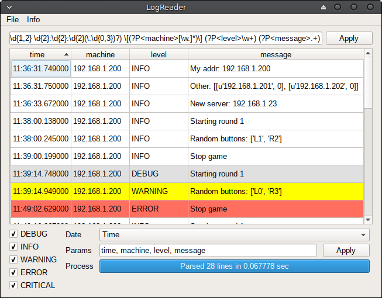

# LogReader

PyQt5 programm for parse and reading any log file

# Features

* Set parse algorithm by regexp
* Paste data from file or clipboard
* Lines are lighlighted by level
* 5 log levels
* 4 variants of time output

# Installation

pip install logreader
